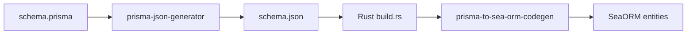

# prisma-to-seaorm

Generate [SeaORM](https://www.sea-ql.org/SeaORM/) entity models from
[Prisma](https://www.prisma.io/) schemas.

> **Note:** This tool is primarily targeted at PostgreSQL. While it may work
> with other databases, PostgreSQL-specific features and types are the main
> focus.

## Overview

This repository provides two tools that work together to convert Prisma schemas
into SeaORM Rust code:

1. **`@trunkio/prisma-json-generator`** - A Prisma generator that exports the
   schema's DMMF (Data Model Meta Format) as JSON
2. **`prisma-to-sea-orm-codegen`** - A Rust library that converts the DMMF JSON
   into SeaORM entity code



## Installation

### Prisma JSON Generator

```bash
npm install @trunkio/prisma-json-generator
# or
pnpm add @trunkio/prisma-json-generator
```

### Rust Codegen Library

Add to your `Cargo.toml`:

```toml
[build-dependencies]
prisma-to-sea-orm-codegen = { git = "https://github.com/trunkio/prisma-to-seaorm" }
```

## Usage

### 1. Configure Prisma Schema

Add the JSON generator to your `schema.prisma`:

<details>
<summary>Example schema.prisma</summary>

```prisma
generator client {
  provider = "prisma-client-js"
}

generator json {
  provider = "prisma-json-generator"
  output   = "../rust-app/schema.json"
}

datasource db {
  provider = "postgresql"
  url      = env("DATABASE_URL")
}

model User {
  id        String   @id @default(uuid()) @db.Uuid
  email     String   @unique
  name      String?
  role      Role     @default(USER)
  createdAt DateTime @default(now()) @map("created_at") @db.Timestamptz(6)

  posts Post[]

  @@map("user")
}

model Post {
  id       String @id @default(uuid()) @db.Uuid
  title    String
  authorId String @map("author_id") @db.Uuid

  author User @relation(fields: [authorId], references: [id])

  @@index([authorId])
  @@map("post")
}

enum Role {
  USER
  ADMIN
}
```

</details>

### 2. Generate JSON

```bash
npx prisma generate
```

This creates `schema.json` containing the Prisma DMMF.

### 3. Generate SeaORM Code

Create a `build.rs` in your Rust crate:

<details>
<summary>Example build.rs</summary>

```rust
use std::{env, fs, path::Path};
use prisma_to_sea_orm_codegen::{parse_prisma_dmmf_datamodel, prisma_to_sea_orm_codegen};

fn main() {
    println!("cargo::rerun-if-changed=build.rs");
    println!("cargo::rerun-if-changed=schema.json");

    let schema_json = include_bytes!("./schema.json");
    let datamodel = parse_prisma_dmmf_datamodel(schema_json).unwrap();

    // Arguments: datamodel, module_name, database_schema
    let code = prisma_to_sea_orm_codegen(datamodel, "my_db", "public").unwrap();

    let out_dir = env::var("OUT_DIR").unwrap();
    let dest_path = Path::new(&out_dir).join("db_codegen.rs");
    fs::write(dest_path, code).unwrap();
}
```

</details>

### 4. Include Generated Code

In your `lib.rs` or `main.rs`:

```rust
include!(concat!(env!("OUT_DIR"), "/db_codegen.rs"));

pub use my_db::*;
```

## Generated Code Features

The codegen produces:

- **Entity models** with `DeriveEntityModel` for each Prisma model
- **Enums** with `DeriveActiveEnum` for each Prisma enum
- **Relations** with proper `Related` trait implementations
- **Unique constraint helpers** - `find_unique()` method for querying by unique
  fields
- **Index helpers** - `find_by_index()` method for querying by indexed fields

<details>
<summary>Example generated code</summary>

```rust
pub mod my_db {
    pub mod user {
        use sea_orm::entity::prelude::*;

        #[derive(Clone, Debug, PartialEq, DeriveEntityModel, Eq)]
        #[sea_orm(schema_name = "public", table_name = "user")]
        pub struct Model {
            #[sea_orm(primary_key, auto_increment = false)]
            pub id: Uuid,
            #[sea_orm(unique)]
            pub email: String,
            pub name: Option<String>,
            pub role: super::sea_orm_active_enums::Role,
            pub created_at: DateTimeWithTimeZone,
        }

        pub enum UniqueConstraint {
            Id(Uuid),
            Email(String),
        }

        impl Entity {
            pub fn find_unique(constraint: UniqueConstraint) -> Select<Entity> {
                match constraint {
                    UniqueConstraint::Id(id) => Self::find_by_id(id),
                    UniqueConstraint::Email(email) => Self::find().filter(Column::Email.eq(email)),
                }
            }
        }

        // Relations, etc.
    }

    pub mod sea_orm_active_enums {
        use sea_orm::entity::prelude::*;

        #[derive(Debug, Clone, PartialEq, Eq, EnumIter, DeriveActiveEnum)]
        #[sea_orm(rs_type = "String", db_type = "Enum", enum_name = "role")]
        pub enum Role {
            #[sea_orm(string_value = "USER")]
            User,
            #[sea_orm(string_value = "ADMIN")]
            Admin,
        }
    }
}
```

</details>

## Supported Prisma Features

### Field Types

| Prisma Type | SeaORM Type                         |
| ----------- | ----------------------------------- |
| `String`    | `String`                            |
| `Int`       | `i32`                               |
| `BigInt`    | `i64`                               |
| `Float`     | `f64`                               |
| `Decimal`   | `Decimal`                           |
| `Boolean`   | `bool`                              |
| `DateTime`  | `DateTime` / `DateTimeWithTimeZone` |
| `Json`      | `Json`                              |
| `Bytes`     | `Vec<u8>`                           |
| `Enum`      | Generated enum                      |

### Native Database Types

- `@db.Uuid` → `Uuid`
- `@db.Timestamptz` → `DateTimeWithTimeZone`
- `@db.Time` → `TimeTime`
- `@db.VarChar(n)` / `@db.Char(n)` / `@db.Text` → `String`
- `@db.SmallInt` → `i16`

### Model Features

- `@id` - Primary keys (single and composite)
- `@unique` - Unique constraints
- `@default()` - Default values
- `@map()` - Custom database column/table names
- `@@index()` - Non-unique indexes
- `@@map()` - Custom table names
- Optional fields (`?`)
- Array/list fields

### Relations

- One-to-one
- One-to-many
- Many-to-many (implicit join tables)
- Self-referential relations
- Cascade/Restrict/SetNull delete policies

## Development

### Prerequisites

- [Nix](https://nixos.org/) with flakes enabled, or:
  - Rust nightly
  - Node.js 22+
  - pnpm

### Setup

```bash
# Enter development shell (with Nix)
nix develop

# Install JS dependencies
pnpm --dir js install

# Generate example schema JSON
pnpm --dir js/packages/example run generate

# Build Rust workspace
cargo build --manifest-path rs/Cargo.toml
```

### Linting

This project uses [Trunk](https://trunk.io) for linting:

```bash
trunk fmt        # Format all files
trunk check      # Check all files
```
